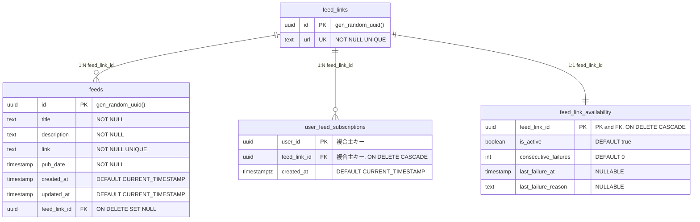
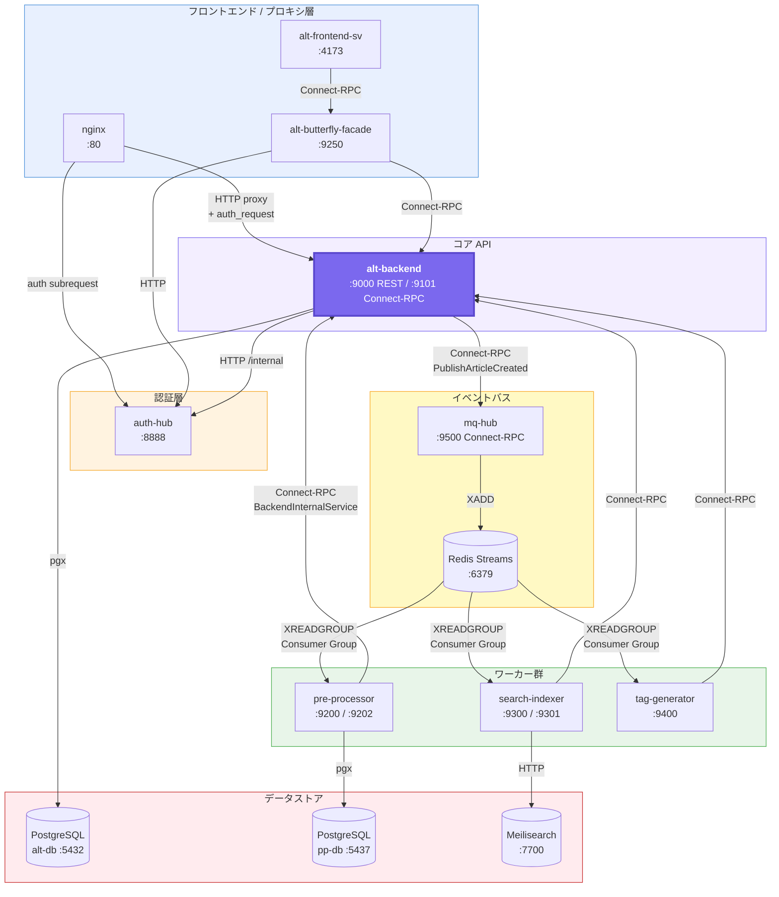
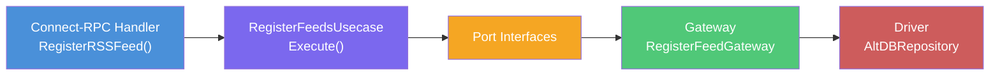
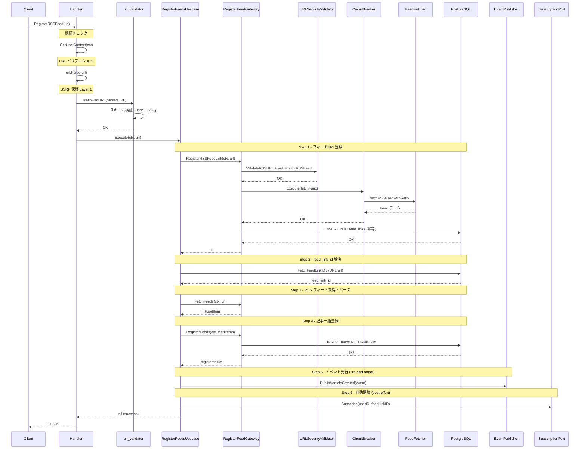
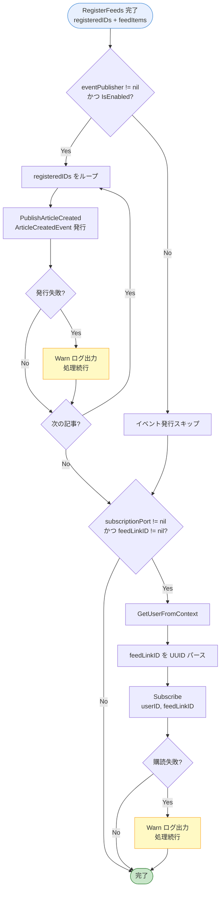
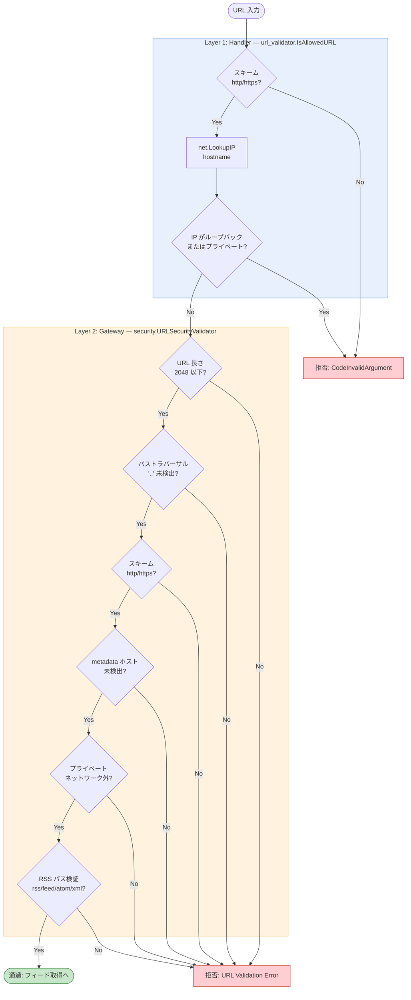
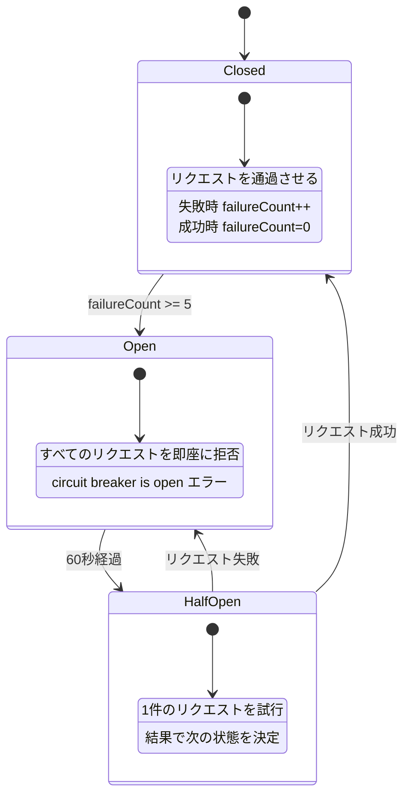

# RSSフィード購読機能の概観


## 前回はこちら

[RSSリーダー・アグリゲーターの作り方 Part 2: バックエンドAPIの進化とアンチパターン](https://zenn.dev/e_kaikei/articles/b6eb88ed8bc590)

<br>

周囲からもらったフィードバックを元に、今回から切り口を変えていく。
機能に焦点を絞って、関連するマイクロサービスを取り上げつつ、実装やDBスキーマなど具体例を交えながら、反省点も含めて記述していくことにする。

## RSSフィード購読機能の概要

### 主要テーブル構造

下記のMermaid図は、RSSフィード購読機能に関連する主要テーブルの構造を示している。
`feed_links` が、購読対象のフィードを管理するマスターテーブルになっている。IDとユニーク制約のついたURLのみから構成された、非常にシンプルなテーブルになっていて、同一フィードの重複登録を防ぐ。

もともとは単一のユーザーのみで認証もなく、ユーザーの概念もない状態からスタートしたので、あまりマルチユーザーを意識していないような構造になっている。
この軸となる `feed_links` テーブルに、3つのテーブルがぶら下がっている。
`feeds`, `user_feed_subscriptions`, `feed_link_availability` だ。

- feeds
  - 全てのユーザーのフィードが蓄積されていくテーブル。
  - タイトルから個別のフィード（エントリ）の説明、リンク、公開日時などが保存される。
  - 設計当初に`updated_at`を追加してしまったが、どのカラムが更新されたかが不明な良くない設計だったと、今は思っている。例えば、`pub_date`が更新されたのか、`link`が更新されたのかなどは`updated_at`の日時からでは判断できないからだ。
  - 基本的には、`updated_at`は要らないと、今は思っている。
- user_feed_subscriptions
  - ユーザーと購読フィードの中間テーブル。
  - どのユーザーがどのフィードを購読しているかを管理する、多対多の中間テーブル。
  - このテーブルがないと、すべてのユーザーがシステムに登録された全フィードの記事を見られる状態になる。`user_feed_subscriptions` は **「自分が購読したフィードの記事だけを表示する」** というユーザーごとの表示スコープを実現するためのテーブルになっている。
- feed_link_availability
  - ユーザーが購読している各RSSフィードの取得可能かどうかを記録するテーブル。
  - バックエンドAPI（alt-backend）が連続失敗回数を記録し、このデータを元に自動無効化判定を行う。




---

### アーキテクチャ図

下記は全体を俯瞰したマイクロサービスのアーキテクチャ図だ。


今回の対象範囲は下の図の通り。
多少はシンプルになったはず。



このRSSフィード登録に絞ったアーキテクチャ図の通りに、今回は流れを見ていく。

---

### RSSフィードの登録フロー

下記は、ユーザーが新しいRSSフィードを登録する際のフロー図だ。





### Connect-RPC ハンドラー層

```
alt-backend/app/connect/v2/rss/handler.go → RegisterRSSFeed()
```

ユーザーからRSSフィードのリンクを受け取るレイヤーで、基本的にセルフホストで個人利用を前提としたものなので攻撃などは無いはずだが、セキュアにしておいて損はないので、最低限のセキュリティ対策は行っている。

1. **認証チェック**: `middleware.GetUserContext(ctx)` でユーザーコンテキストを取得する。具体的には、認証情報のキャッシュを担うマイクロサービス `auth-hub` を経由して[Ory Kratos](https://github.com/ory/kratos)から`UserID`などを取得する。
2. **URL バリデーション**: 空文字チェック、`url.Parse` による構文検証
3. **SSRF 対策**: `url_validator.IsAllowedURL(parsedURL)` でプライベートネットワークへのアクセスを禁止している。

検証を通過した URL は `container.RegisterFeedsUsecase.Execute(ctx, url)` に委譲される。


### Usecase 層

```
alt-backend/app/usecase/register_feed_usecase/feeds_usecase.go
```

`RegisterFeedsUsecase` は 3つのPortとオプションのPortを受け取って、下記の処理を行う。

- `RegisterFeedLinkPort` -- フィード URL の永続化
  - `feed_links` テーブルに登録する
- `RegisterFeedsPort` -- パースした記事群の永続化
  - `feeds` テーブルに登録する
- `FetchFeedsPort` -- RSS フィードの取得・パース
  - RSS フィードを取得してパースする
- `SubscriptionPort`（optional） -- ユーザー自動購読
  - ユーザーが新しいRSSフィードを登録した際に、そのフィードへの購読が自動的に作成される仕組みで、AltのRSSフィードの定期収集の要となっていて、ここを起点としてAltのナレッジパイプラインとして機能する。
  - 当然、後から手動で「購読解除（Unsubscribe）」も可能だ。

#### フィード登録のシーケンス図

下記は、`RegisterRSSFeed`への1回のHTTPリクエストで起きる処理の全体像だ。




#### イベント発行 & 自動購読フロー

Step 5・6 はメイン処理とは独立して実行される後処理で、失敗してもメイン処理には影響を与えないようになっている。
Warnログを出すだけで、システムが落ちないような設計にした。
`publishFeedEvents` と `autoSubscribeUser` の判断フローを以下に示す:




### Gateway層

今ブログに書いていて、設計ミスで反省点だと感じている。
当初は単純なDBへの登録をするためにDriverを呼び出すだけだったが、セキュリティ面やリトライなどの品質を求めて改修していった結果として、ファットなGatewayができてしまった。
やはりClean Architectureに沿うなら、Usecaseでオーケストレーションできるようにロジックを移し、単一責務で関心事も絞ったGatewayにすべきだったと思う。


```
alt-backend/app/gateway/register_feed_gateway/single_feed_link_gateway.go
```

`RegisterFeedGateway`はフィード登録処理において、下記の責務を担う。

- SSRF 保護 (URLSecurityValidator)
- サーキットブレーカー
- 指数バックオフリトライ


```go
type RegisterFeedGateway struct {
    alt_db           *alt_db.AltDBRepository
    feedFetcher      RSSFeedFetcher
    urlValidator     *security.URLSecurityValidator
    circuitBreaker   *resilience.SimpleCircuitBreaker
    metricsCollector *metrics.BasicMetricsCollector
}
```

#### SSRF 保護 (URLSecurityValidator)

`security.URLSecurityValidator`は、多層的にURL検証を行って、事前に定義したパターンでのSSRF攻撃への対策を行っている。例えば、HTTP/HTTPSにスキームの制限をしたり、クラウド環境で使われる特定の内部IPアドレス（例：169.254.169.254）やメタデータサーバーへのアクセスを遮断している。


| チェック項目 | 内容 |
|-------------|------|
| 長さ制限 | 2048 文字以下 |
| パターン検出 | `..`（パストラバーサル）の検出 |
| スキーム制限 | HTTP/HTTPS のみ許可 |
| メタデータサーバー | ホスト名に `metadata` を含む URL をブロック |
| プライベートネットワーク | localhost, ループバック, RFC 1918, リンクローカル, `.local`/`.localhost` を遮断 |
| RSS パス検証 | パスに `rss`, `feed`, `atom`, `xml`, `feeds` を含むか確認 |

> 実装: `alt-backend/app/utils/security/url_validator.go`

Handler層とGateway層の2段階でバリデーションが行われる全体フローを次に図示する:



#### サーキットブレーカー

`resilience.SimpleCircuitBreaker`がフィード取得処理全体で動作し、外部への過剰なリクエストをし続けることと、Alt内部の過剰なリソース消費を防ぐ。これにより、外部サービス障害がAltのシステム全体に波及することを防ぐ。



設定値: `FailureThreshold: 5`, `ResetTimeout: 60s`, `MaxConcurrentRequests: 10`

#### 指数バックオフリトライ

`fetchRSSFeedWithRetry`メソッドが接続エラーやタイムアウトに対して指数バックオフでリトライする。
この実装は、外部サービスが障害や一時的に後負荷状態に陥っている際に、対象サービスへの負荷軽減をするためにある。

次の通りの実装:

```go
for attempt := 0; attempt < constants.DefaultMaxRetries; attempt++ {
    if attempt > 0 {
        delay := time.Duration(float64(constants.DefaultInitialDelay) *
            math.Pow(2, float64(attempt-1)))
        time.Sleep(delay)
    }
    // フィード取得を試行...
}
```

指数バックオフとは、2秒 -> 4秒 -> 8秒といった感じで、リトライ間隔が指数関数的に伸びていく仕組みだ。

初回は遅延なしで即座に試行し、リトライ時にのみ指数バックオフが適用される仕組みになっている。リトライ対象は `timeout`, `deadline exceeded`, `connection refused`, `no such host`, `502`, `503`, `504` のエラー。それ以外（400, 403, 404 等）は即座に失敗として扱う。
400番台を失敗として扱う判断をしたのは、400（Bad Request）、403（Forbidden）であれば、無駄なリクエストであることや明確な拒絶の意思をくみ取れるからだ。
404（Not Found）についても、基本的にフィードのURLが復活する可能性は低いので、失敗として扱う判断をした。


---

## まとめ

本記事では、RSSフィード登録処理の全3回中1回目として、DBスキーマから各登録処理の詳細にまで踏み込んで、実際のソースコードも取り上げてきた。
Gateway層が機能の進化に連れてファットになってしまったり、DB設計に不要なカラムが混じったりと、複数の課題が見つかった。

まだ、これらは「登録」した瞬間に起きる処理に過ぎず、次回以降はその登録されたフィードがどのように意味を持ち、価値ある情報へと変わっていくのかを見ていく。具体的には、スケジューラによる定期収集の仕組みや、Redis Streams を使ったイベント配信のパターンを取り上げる。
