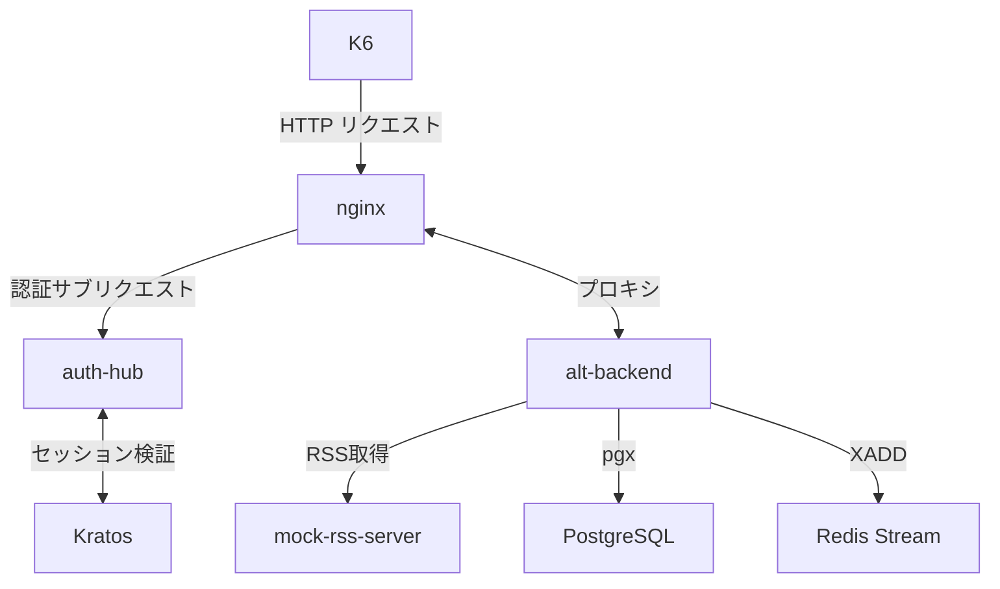
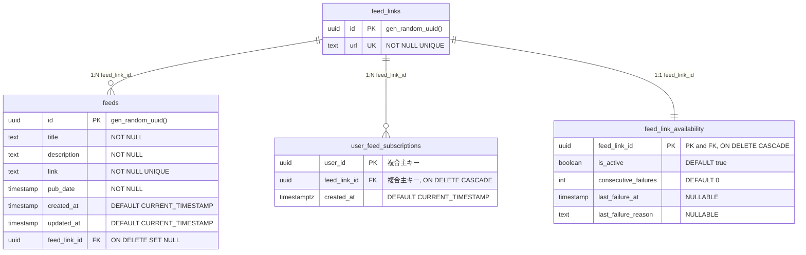
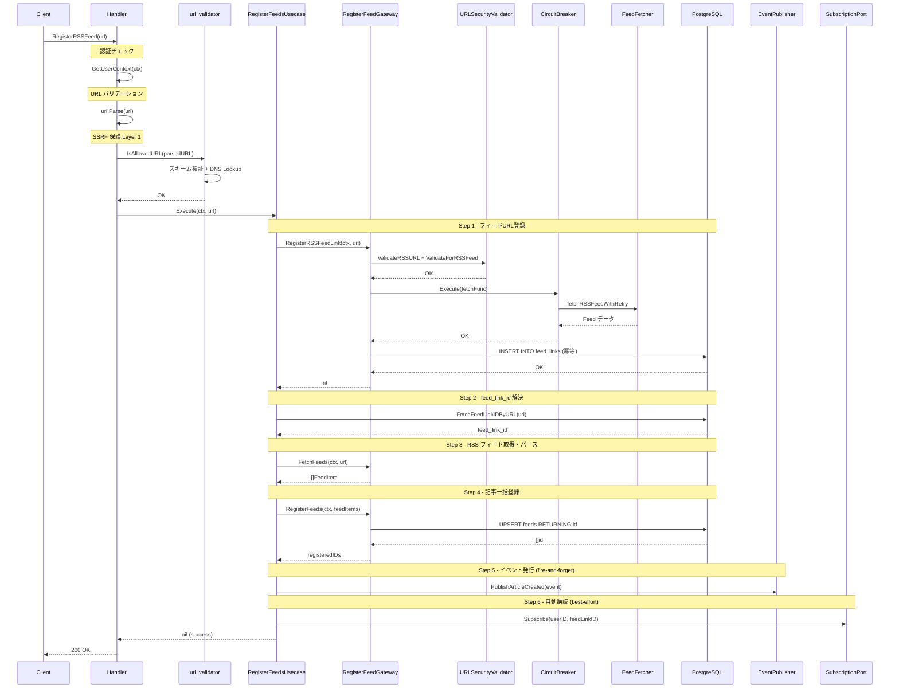

# RSSフィード購読機能の概観


## 前回はこちら

[RSSリーダー・アグリゲーターの作り方 Part 2: バックエンドAPIの進化とアンチパターン](https://zenn.dev/e_kaikei/articles/b6eb88ed8bc590)

<br>

周囲からもらったフィードバックを元に、今回から切り口を変えていく Part 2。
~~機能に焦点を絞って、関連するマイクロサービスを取り上げつつ、実装やDBスキーマなど具体例を交えながら、反省点も含めて記述していくことにする。~~

魂がこもっていないというフィードバックがあったので、負荷試験も実施して冗長な機能とアーキテクチャ説明に終始しないように大幅に書き換えることにした。
確かに自分で読み返しても、Altの「説明書」を読んでいるような感じがした。説明書なら今どきLLMに書かせればよいし、すでにドキュメントも整備されているので、自分が書く意味がないと思った。
今回も[K6](https://github.com/grafana/k6)での計測を行った。

古い版も見たい方は、[こちら](https://github.com/Kaikei-e/Zenn/blob/0bc8d8b4f2272d0404360a8c51c30f2bd174aadb/articles/1f15fbe9c065a3.md)。

## 結論: PgBouncer導入でフィードの登録成功率を約98.9%にまで上昇させることができた

K6による負荷試験を実施したところ、過半数がフィード登録できないという結果になった。
負荷試験を軽く先に説明すると、3000VUで50フィードを120秒間で登録するシナリオだ。
改善前は、大量のアクセスによってDBのコネクションが飽和して、RSSフィードの登録成功率は、40.2%に留まった。
しかし、PgBouncerを導入して、PgBouncerが大量のリクエストを受けてコネクションを管理することで、RSSフィードの登録成功率は、98.9％にまで上昇した。
残りの数％はRSSフィードを返すローカルのMockサーバーが高負荷で耐えられなくなったためにフィード登録に失敗しているので、Altのシステム自体は改善されたと言える。

下図のAltの負荷試験結果を見てほしい。
改善前後で比較したグラフで、前述の大幅な改善が見られた。
合計登録前で33000件なのは、リトライ機構が働いているからだ。


## RSSフィードの登録機能について

- クリーンアーキテクチャを採用したバックエンドAPIがメインでリクエストをさばく。
  - クリーンアーキテクチャを採用した最大の理由は、システムが巨大化しても、コードの可読性を保ちつつ依存方向は内側に向くという縛りがあるので、アーキテクチャにブレが生じづらいからだ。この利点を活かして、機能の追加が容易になり複製が得意な生成AIとの相性も良いという恩恵を現在得られている。
  - またPart2でも述べたが、多数のマイクロサービスに共通のアーキテクチャを採用して認知負荷を下げられる点、Driver層の差し替えのみでDB、外部API、Alt内のマイクロサービスなのかを切り替えられる点なども理由に挙げられる。
- フローは下記の順になっている。ステップが多いが、最初はもっと素朴だった。だがAltの実装は楽しみながら、自分の役に立つものを作りたいという動機から始まり、セキュリティ面やユーザー体験をプロダクション品質まで高めたいという挑戦でもあるので、このようなフローになっている。
  - 認証チェック -> URLバリデーション -> SSRF対策でURL検証 -> フィードURLの永続化 -> RSSフィードの取得 -> RSSフィードのパース -> ユーザー自動購読
- 認証チェックでは、Kubernetes（以下k8s）ネイティブを謳う[Ory Kratos](https://github.com/ory/kratos)を採用した。AltはDocker Composeで動くが、k8sでの稼働も視野に入れての選択だ。認証基盤の移行は高コストであり、ベンダーロックインも避けたかったので、セルフホスト可能なOry Kratosを選んだ。
  - 今依存しているのは、Cloudflare TunnelとInoreaderくらいだと思う。Inoreaderについてはオプションであり、Cloudflare Tunnelは出先からアクセスする際に必須になる。
- SSRF対策では、主に内部への悪意あるアクセスや、パストラバーサルへの対処をしている。
- これらの基礎を備えつつ、フィード登録も高速にできるように、実装過程で工夫をしてきた。

## 本番稼働するような品質のシステムなら、負荷試験に耐えてフィードをすべて登録できるべき

最初に記載したフィードバックを受けて、ふと思った。本当にAltはスケーラブルで、プロダクションレディな品質であることを保証できているのか？と。
もともとユーザーの概念が無いシンプルなセルフホストのRSSリーダーとして開発をスタートした。そこへ、ユーザー認証を追加し、セキュリティ対策を導入し、レートリミットで外部への負荷を減らすような実運用を想定した改修を重ねてきた。
だが、負荷試験をしていなかった。これではなにも証明する手段がない。
なので、今の実装が本当に実運用に耐えうるのか、そして負荷試験をしてシステムが壊れる限界を探ってみようと思った。

登録フローの概観をつかんでもらうために、まずは実際のフローをざっくり図示する。




## システム概観をちょっとだけ

### 主要テーブル設計

下記のMermaid図は、RSSフィード購読機能に関連する主要テーブルの構造を示している。
`feed_links` が、購読対象のフィードを管理するマスターテーブルになっている。IDとユニーク制約のついたURLのみから構成された、非常にシンプルなテーブルになっていて、同一フィードの重複登録を防ぐ。

もともとは前述の通りに、単一のユーザーのみで認証もなく、ユーザーの概念もない状態からスタートしたので、あまりマルチユーザーを意識していないような構造になっている。
この軸となる `feed_links` テーブルに、3つのテーブルがぶら下がっている。
`feeds`, `user_feed_subscriptions`, `feed_link_availability` だ。

- feeds
  - 全てのユーザーのフィードが蓄積されていくテーブル。
  - タイトルから個別のフィード（エントリ）の説明、リンク、公開日時などが保存される。
  - 設計当初に`updated_at`を追加してしまったが、どのカラムが更新されたかが不明な良くない設計だったと、今は思っている。例えば、`pub_date`が更新されたのか、`link`が更新されたのかなどは`updated_at`の日時からでは判断できないからだ。
  - 今は前述の理由で、`updated_at`は要らないと思っている。
- user_feed_subscriptions
  - ユーザーと購読フィードの中間テーブル。
  - どのユーザーがどのフィードを購読しているかを管理する、多対多の中間テーブル。
  - このテーブルがないと、すべてのユーザーがシステムに登録された全フィードの記事を見られる状態になる。`user_feed_subscriptions` は **「自分が購読したフィードの記事だけを表示する」** というユーザーごとの表示スコープを実現するためのテーブルになっている。
- feed_link_availability
  - ユーザーが購読している各RSSフィードの取得可能かどうかを記録するテーブル。
  - バックエンドAPI（alt-backend）が連続失敗回数を記録し、このデータを元に自動無効化判定を行う。





### フィード登録のシーケンス図

下記は、`RegisterRSSFeed`への1回のHTTPリクエストで起きる処理の全体像だ。
これだけのことが、実際の1回のRSSフィード登録リクエストで起きている。
登録だけで下図のような段階を踏んでいて、ここを起点としてフィードの定期取得や、記事のタグ付け、検索のための索引、LLMによる要約、過去3日間の全記事振り返りなどが機能する。
Altが機能する、全ての起点となる重要な処理が「RSSフィード登録」だ。




### Gateway層の設計ミス

今ブログに書いていて、設計ミスで反省点だと感じている点を先に振り返っておきたい。
当初は単純なDBへの登録をするためにDriverを呼び出すだけだったが、セキュリティ面やリトライなどの品質を求めて改修していった結果として、ファットなGatewayができてしまった。
やはりClean Architectureに沿うなら、Usecaseでオーケストレーションできるようにロジックを移し、単一責務で関心事も絞ったGatewayで、それぞれのGatewayがHTTP通信とDBアクセスのみを担う形にすべきだったと思う。

```
alt-backend/app/gateway/register_feed_gateway/single_feed_link_gateway.go
```

`RegisterFeedGateway`はフィード登録処理において、下記の責務を担う。

- SSRF 保護 (URLSecurityValidator)
- サーキットブレーカー
- 指数バックオフリトライ


```go
type RegisterFeedGateway struct {
    alt_db           *alt_db.AltDBRepository
    feedFetcher      RSSFeedFetcher
    urlValidator     *security.URLSecurityValidator
    circuitBreaker   *resilience.SimpleCircuitBreaker
    metricsCollector *metrics.BasicMetricsCollector
}
```

## 本題の負荷試験

### 1.1 テスト構成

単一マシンでの実行で、Kratosがボトルネックになったのでレプリカ数を増やして対応した。
Kratosについては後述する。

| 項目 | 値 |
|------|-----|
| ホストリソース | 24 CPU / 62GB RAM / 253GB disk |
| Kratos レプリカ数 | 3 (512MB each, LOG_LEVEL=warning) |
| auth-hub レプリカ数 | 2 (512MB each, CACHE_TTL=30m) |
| alt-backend | 4GB / 8CPU, DB_MAX_CONNS=500 |
| PostgreSQL | max_connections=600, shared_buffers=512MB |
| nginx | worker_connections=8192, access_log off |
| K6 | 16GB / 8CPU |
| K6 エグゼキュータ | ramping-vus (0→3000 in 60s, steady 120s) |

### 1.2 段階的テスト実行

負荷試験は以下の3パターンでおこなった。
1VUは1つの仮想ユーザーで、Botのように高速にリクエストをし続ける存在だと捉えられる。つまり人間のような操作に間隔は生じることはない。
1リクエストは、1つのRSSフィード登録を意味する。

1. 5VU × 3リクエスト
2. 100VU × 10リクエスト
3. 3000VU × 50リクエスト

### 1.3 負荷試験のシナリオ

現実のユーザー操作にできるだけ近づけるために、Nginxを経由して認証（Kratos）し、alt-backendに実際のユーザーがRSSフィードを登録していく形にした。
ここで、RSSフィードはMockサーバーを立てて、外部へのリクエストは一切行わないように工夫した。
IPアドレスも、RSSフィードも、個別のフィードもすべてランダムにして、現実の負荷になるべく近い状況を再現した。

今回は最も高負荷な3000VU × 50リクエストの結果について書いていく。
大規模なユーザー数とリクエスト数で、このシステムのどこが壊れるかを確認したかった。

結論として、3000VUで50リクエスト、つまり150000リクエストでシステムは落ちないものの、リクエストの過半数が失敗する結果となった。

---

### 2. 3000VU テスト詳細結果

#### 2.1 K6 メトリクス

##### 目標達成状況

- HTTPリクエスト失敗率は17.27%で、目標の20%を下回った。
- フィード登録率は81.28%で、目標の80%を上回った。
- フィード登録失敗が多数発生していることは大きな問題だ。

| 指標 | 目標 | 結果 | 判定 |
|------|------|------|------|
| http_req_failed | < 20% | **17.27%** | PASS |
| checks (成功率) | > 80% | **81.28%** | PASS |
| feed_register_errors | < 100,000 | 39,140,893 | FAIL |

※補足だが、39,140,893という数値は、リトライ込みのフィード登録失敗数を指す。負荷試験のK6側で実装がよくなく、大量のリクエストをリトライするようになっていた。

#### 2.2 レイテンシ分布

##### HTTP リクエスト レイテンシ分布（全リクエスト）

最速で719usと速いが、平均は14.2秒とかなり遅い。
全リクエストの中央値は16.3秒と、かなり遅い結果となった。


##### HTTP リクエスト レイテンシ分布（成功リクエストのみ）

成功したリクエストに絞っても、中央値は16.7秒とかなり遅い結果となった。


##### フィード登録レイテンシ分布 (feed_register_duration)


##### レイテンシから見たボトルネック分析

- ネットワーク遅延は、Dockerの内部通信なので、問題ない
- リクエスト送信も、平均72.7usと問題ない
- レスポンス受信も、平均352usと問題ない
- サーバー処理待ちが、平均14.24sと全体の99.997%を占めている

次に、HTTPリクエストのエラー内訳を見てみる。

##### エラー内訳: HTTP失敗した、4,649件

| エラー種別 | 件数 | 割合 | 根本原因 |
|-----------|------|------|---------|
| Rate limit (auth-hub 429) | 4,181 | 89.9% | VALIDATE_RATE_LIMIT=10000でもピーク時に超過 |
| Login errors (kratos) | 264 | 5.7% | kratos DB接続タイムアウト |
| その他 (502等) | 204 | 4.4% | nginx → auth-hub 間の一時的な502 |
| **合計** | **4,649** | **100%** | — |

全て認証系で落ちている。これは、今回負荷試験を複数回実施した際にわかったが、水平スケーリングかレートリミットを上げれば解決するので、根本原因ではない。

では、根本原因はなにか？

## ボトルネック分析

### PostgreSQL接続飽和

フィード登録対象のメインDBはPostgreSQLを使っていて、alt-dbという名称になっている。
通常は、コネクション数を100で設定しているが、負荷試験で失敗があまりに多いので、スケールアウトしてみての計測だった。
CRUDでいう単純なCREATEしか行わないので、Echo・Goで構成されるメインのサーバーはこの程度のリクエストなら捌けている。

しかし、負荷試験用にPostgreSQLのコネクションプールを最大600まで増やしても処理しきれないのはおかしい。ここで、設計の問題に気が付いた。
調べたところコネクションプールはやはり100から300程度が適切なようなので、設計に問題があるようだ。

<br>

まさか、HTTPリクエスト中にDBコネクションを張っているのかとも思ったが、そんなこともなかった。
下記はUsecase層（`feeds_usecase.go:53-110`）の全体フローだ。

| ステップ | メソッド名 | 外部通信 | データベース操作 | DB操作目安時間 |
|----------|------------|----------|------------------|----------------|
| 1 | `RegisterRSSFeedLink()` | HTTP fetch | BEGIN → INSERT → COMMIT | < 10ms |
| 2 | `FetchFeedLinkIDByURL()` | - | SELECT | < 5ms |
| 3 | `FetchFeeds()` | HTTP fetch | (DB不要) | - |
| 4 | `RegisterFeeds()` | - | BEGIN → BATCH INSERT → COMMIT | < 50ms |
| 5 | `publishFeedEvents()` | MQ publish | (DB不要) | - |
| 6 | `autoSubscribeUser()` | - | INSERT | < 5ms |

3000VU × 50フィードで150000回のフィード登録を120秒で実行するので、約1,250 ops/secをさばくことになる。

少なくとも自分とLLMで調査した中では、アーキテクチャや設計に問題はなかった。そもそもの話になってしまうが、1250 ops/secを捌くような設計にはなっていないからだ。
だが良い機会なので、[PgBouncer](https://pgbouncer.org/)を導入して、リクエストのスパイク時でも安定的に稼働するシステムへと改修してみた。

> PgBouncerとは、軽量なコネクションプロキシで、アプリケーション側からの大量のリクエストを受けつつ、軽量なコネクションプロキシに多重化（multiplexing）してくれます。

とのことで、コネクション数飽和を防ぎつつ、コネクションの効率化を行ってくれるものだと理解した。

### 導入結果

50フィードでも試験して同様の改善が見られたので、3000VUで100フィード登録を120秒間実行する負荷試験を実施した。

PgBouncer導入後の結果は下記の表の通りで、大幅な改善が見られた。
アプリケーションで問題が無くても、DBがボトルネックになることを学んだ。
何も工夫をせずにコネクションプールを思考停止でただ増やすのは悪手であること、それからユーザー数に応じたアーキテクチャや設計があることも学んだ。

1ユーザーと1万ユーザーでは、当然ながら必要なアーキテクチャや設計は異なることなんてわかっていたつもりだったが、それを今回体感した。

| メトリクス | 改善前 | 改善後 | 変化 | 判定 |
|-----------|--------|--------|------|------|
| http_req_failed rate | 47.10% | 1.71% | -96.4% | PASS |
| feed_register_errors count | 19,928 | 158 | **-99.2%** | PASS |
| feed_register_duration p(95) | 28,328ms | 29,644ms | +4.6% | PASS |

※補足だが、feed_register_errors countの変化は、負荷試験のK6側での実装を改善後に、PgBouncer導入以前以後で再計測したものだ。


#### RSSフィード登録結果

| メトリクス | 値 |
|-----------|-----|
| 登録された feed_links | 14,315 |
| 成功イテレーション | 14,020 |
| 登録成功率 | 98.9% |
| DB active connections (テスト後) | 1 |

これでもまだ失敗しているものは、Mockサーバーが単一のコンテナで稼働しており、同時接続数が Linux の ephemeral port 上限に達したものだ。

Mockサーバーのコンテナ数も水平スケーリングすれば改善するだろう。

---

## まとめ

本記事では、RSSフィード登録処理をパフォーマンスの観点から踏み込み、実際のソースコードも取り上げつつ改善を行ってきた。将来的なスケールを考慮しすぎるのはYAGNIに反すると思うが、PgBouncerの導入はそのアーキテクチャの複雑度というデメリットを上回るメリットがあると感じた。
計測し、負荷を掛けることで、改善点が見つかった。やはり、「推測するな、計測せよ」は重要だ。そのおかげで、システムも負荷に耐えられるように進化した。
AltのバックエンドAPI自体には欠陥は見当たらなかったが、負荷を掛けたおかげで思わぬ箇所にボトルネックが見つかった。

まだ、これらは「登録」した瞬間に起きる処理に過ぎず、次回以降はその登録されたフィードがどのように意味を持ち、価値ある情報へと変わっていくのかを見ていく。具体的には、スケジューラによる定期収集の仕組みや、Redis Streams を使ったイベント配信のパターンを取り上げる。
