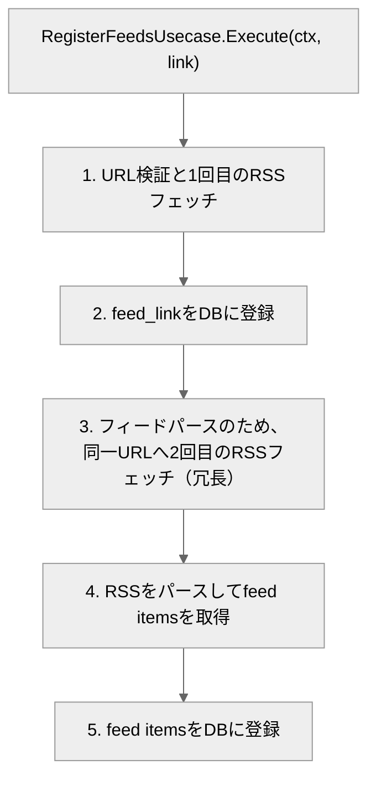
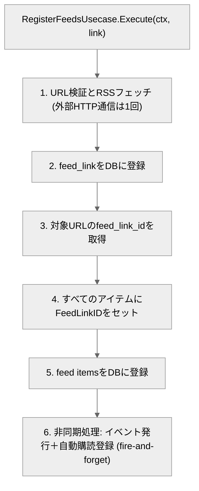

# スループット8.46倍とp95を29.28秒→2.99秒のパフォーマンスチューニングをした記録

対象のOSSリポジトリは[こちら](https://github.com/Kaikei-e/Alt)。

[前回の記事](https://zenn.dev/e_kaikei/articles/1f15fbe9c065a3)の予告とは異なり、パフォーマンスチューニング第2弾の記事にする。

前回、PgBouncer導入により、HTTPリクエストの成功率を40.2%から98.9%に改善した。だが、フィード登録の95パーセンタイル（以下、p95）は29.28秒だった。

> ※95パーセンタイル（p95）とは、全体の95%の範囲を表す。

前回、アーキテクチャや設計には問題はなかったと、結論づけてしまった。
よくある、パフォーマンスチューニングのアンチパターンで、目の前の大きな値に飛びついてしまった。実際、PgBouncer導入でHTTPリクエストのエラー率が大幅に改善したので意義はあった。しかし、今回のようなボトルネックの核心へは迫れなかった。
記事投稿後に何度も記事を読み返していて、いくら高負荷時でもp95が29.28秒は明らかにおかしいと思い、何度かの再試験を実施して追加のボトルネックを特定した。
改善をしたら、案の定速くなったので記事にする。

今回は、前回より短めに。

p95が29.28秒ということは、全リクエストの内で95%まで範囲を広げると、フィード登録機能に約30秒かかるユーザーがいるということだ。

<br>

高負荷時とは言え、改善の余地があると思った。
本記事では、まず結果を挙げて、その後改善箇所を挙げていく。

## 結論: キャッシュ、並列化、非同期、接続プーリングを組み合わせて、スループット（処理量）を約8.46倍、応答時間（p95）を約10倍速くした

まずは、登録処理のパフォーマンス比較図を貼る。


青がチューニング以前、赤がチューニング以後だ。
p95が29.28秒から2.99秒に短くなった。約10倍だ。

次に、スループット比較図を貼る。


青がチューニング以前、赤がチューニング以後だ。

- スループットが8.46倍になった
- エンドツーエンド（E2E）で803.3 reg(ister)/s、秒間で約800件のフィード登録が可能になった
- リクエストでは、877 req/sを、HTTPリクエストエラーなく、アプリケーション内でのエラーもなく、201ステータスでさばけるようになった

## ざっくり推定をClaudeにしてもらった

Claudeにフィード登録を実ユーザーが実施している場合のキャパシティを推定してもらった。

> ADR-343後のシステム実効値は803 reg/s（フィード登録処理、median 1.6秒）です。
> シナリオ1: 「全員が同時にフィード登録している」瞬間
> 実ユーザーがフィードを探して、URLを貼って、登録ボタンを押すまでのthink timeを仮定します。

※ Claudeの推定結果
|think time|同時ユーザー数 (803 reg/s × think time)|
|---|---|
|30秒（せっかちに連続登録）|~24,000人|
|60秒（普通のペース）|~48,000人|
|120秒（記事を読みながら）|~96,000人|

改善以後はスループット向上で、同時に登録できるユーザー数も大幅に増加したと推測できる。
これ自体は、AltでのRSSフィード登録処理にのみ絞った推定なので、実際のユーザー数は推定値を下回るだろう。
それでも、大幅な改善ができたことは事実だ。

---

### 負荷試験のシナリオ

- 3000VU
- 50フィードを登録する
- 3000VUが、1000種類のRSSフィードを登録する
- 120秒間の間に処理しきれるか
- フィード登録のエンドポイントをnginx込みで認証も含めて負荷を掛ける
  - なるべく実際のユーザーの操作に近づけるため

※ ちなみにVUとは、K6上で定義したシナリオを実行するVirtual Userの略称で、人間の動作を模倣するもののリクエストは機械的に送る。そのため、実際のユーザー操作よりも高負荷が実現できる。

### やったこと

- HTTPリクエストの無駄をなくし、1回のHTTPリクエストへ削減した
  - RSSフィード登録時に、RSSフィード取得と個別のフィードを取得する際に2回のリクエストを無駄にしていた。それを、1回目のリクエストで得たデータを使って、個別フィードのパースを行うようにした。
- 受けるマイクロサービスの負荷軽減のために行っていたRedis Stream向けイベント発行を、並列化と非同期化した
  - `go`キーワードによるgoroutine化と、`context.WithoutCancel(ctx)` でHTTPレスポンス送信後もgoroutineが生存するようにした。
- [Goの`singleflight`](https://pkg.go.dev/golang.org/x/sync/singleflight)を活用して、同じURLへの並行リクエストが「1回の実際の取得処理」にまとめられるようにした。
  - `golang.org/x/sync/singleflight.Group`を使った。
  - このパッケージについては、後述する。
- HTTPクライアントの生存時間を延ばして、関数呼び出しの度にクライアントを生成するコストを削減した。
- Redis Streamにつながる、`mq-hub`というマイクロサービスへの接続プーリングを活用して、接続を再利用するようにした。

やったことを費用対効果を考慮して、高い順に並べると下記だ

1. HTTPリクエストの半減
2. 並列化と非同期化
3. singleflightの導入
4. クライアントの共有


1: リクエストの時間が単純に半減するので、外部APIが遅いほど有効
2: ボトルネックになりやすい直列処理は、複雑度とのトレードオフを考慮しても採用するメリットが大きいと思うため
3: 今回の試験では1000/3000が同一URLだったため効果が際立ったが、実運用では同一URLの同時登録頻度は下がるため、汎用的な効果は2より限定的と判断した。
4: 後述の詳細パートにも記載の通り、収集したメトリクスからパフォーマンスへの影響は軽微であったため。

---

## 改善の詳細

### 不要なリクエストを減らし、処理フロー内のリクエスト数を1回にした

#### 旧フロー

やったことは単純で、RSSフィード登録時にRSSフィード取得と個別のフィードを取得する際に2回のリクエストを無駄にしていた。それをURLバリデーション、セマフォ管理とサーキットブレーカーをしてから、RSSフェッチとRSSパースを行うように変更した。
後述の`singleflight`の仕組みを活用して、同じURLへの並行リクエストを1回の実際の取得処理にまとめたので、その点でもこの効率化が効いている。



#### 新しいフロー

実際のコードを下に添付するが、以下は簡易的に図示した新フローだ。



これが実際のコードになる。

```go
func (r *RegisterFeedsUsecase) Execute(ctx context.Context, link string) error {
	// 1. Validate URL + fetch RSS (single external HTTP call)
	parsedFeed, err := r.validateAndFetchPort.ValidateAndFetch(ctx, link)
	if err != nil {
		logger.Logger.ErrorContext(ctx, "Failed to validate and fetch RSS feed", "error", err)
		return errors.New("failed to register RSS feed link")
	}

	// 2. Register feed_link in DB (DB-only operation)
	err = r.registerFeedLinkPort.RegisterFeedLink(ctx, parsedFeed.FeedLink)
	if err != nil {
		logger.Logger.ErrorContext(ctx, "Failed to register feed link", "error", err)
		return errors.New("failed to register RSS feed link")
	}

	// 3. Look up feed_link_id for this URL to associate feeds with their source
	var feedLinkID *string
	if r.feedLinkIDResolver != nil {
		feedLinkID, _ = r.feedLinkIDResolver.FetchFeedLinkIDByURL(ctx, parsedFeed.FeedLink)
	}

	// 4. Set FeedLinkID on all items
	for _, item := range parsedFeed.Items {
		item.FeedLinkID = feedLinkID
	}

	logger.Logger.InfoContext(ctx, "Feed items", "count", len(parsedFeed.Items))

	// 5. Register feed items in DB
	ids, err := r.registerFeedsGateway.RegisterFeeds(ctx, parsedFeed.Items)
	if err != nil {
		logger.Logger.ErrorContext(ctx, "Failed to register feeds", "error", err)
		return errors.New("failed to register feeds")
	}

	logger.Logger.InfoContext(ctx, "Feed items registered", "count", len(parsedFeed.Items))

	// 6. Fire-and-forget: event publishing + auto-subscribe (truly async)
	// Use context.WithoutCancel so goroutines survive after HTTP response is sent.
	// Both operations already log errors without propagating them.
	bgCtx := context.WithoutCancel(ctx)
	go r.publishFeedEvents(bgCtx, ids, parsedFeed.Items, feedLinkID)
	go r.autoSubscribeUser(bgCtx, feedLinkID)

	return nil
}
```


---
<br>

### イベント発行の並列化と非同期化

前述の設計判断により、イベント発行は同期的に実行されていた。10件の記事に対して直列で Connect-RPC を呼び出すため、3000VUの高負荷状況下では2-10sのレイテンシが増していた。

そこで、並列化と非同期化を行った。

先程の登録フローの「6. 非同期処理: イベント発行＋自動購読登録 (fire-and-forget)」に当たる箇所だ。
下に抜き出したが、ゴルーチンを起動してRedis Stream向けのイベントの発行と、自動購読登録を行うようにした。

```go
	bgCtx := context.WithoutCancel(ctx)
	go r.publishFeedEvents(bgCtx, ids, parsedFeed.Items, feedLinkID)
	go r.autoSubscribeUser(bgCtx, feedLinkID)
```

このコードにはgoroutineのリークの懸念がある。
`context.WithoutCancel` で起動したgoroutineはHTTPハンドラのライフサイクルから切り離されるため、接続先が応答しない場合やプロセスのシャットダウン時に、goroutineが適切に終了しない可能性がある。
これを防ぐには、graceful shutdown時にこれらの完了を待つサーバーレベルでの仕組みの導入が推奨される。

現状このシナリオはAltでは起きづらいので、今回は実装を見送った。

---
<br>

### [singleflight](https://pkg.go.dev/golang.org/x/sync/singleflight)による重複リクエストの抑制

今回の負荷試験シナリオで特に有効だったのは確かだが、一般的なシナリオとして、ユーザーが同一のRSSフィードを登録する場合は十分にあり得るだろう。それが、120秒間の間に行われるかは別として、`singleflight`を導入することで、同一URLの登録リクエストを抑制することができる。

`singleflight`の仕組みは以下のようだ。

> Package singleflight provides a duplicate function call suppression mechanism.
> ※ Claudeによる訳
> `singleflight`パッケージは、重複する関数呼び出しを抑制するメカニズムを提供します。

> Do executes and returns the results of the given function, making sure that only one execution is in-flight for a given key at a time. If a duplicate comes in, the duplicate caller waits for the original to complete and receives the same results. The return value shared indicates whether v was given to multiple callers.
> ※ Claudeによる訳
> `Do`は、指定された関数を実行し、その結果を返します。その際、ある特定のキーに対して同時に実行中（in-flight）の処理が1つだけになることを保証します。同じキーで重複したリクエストが来た場合、後から来た呼び出し元は最初の実行が完了するまで待機し、同じ結果を受け取ります。戻り値の`shared`は、その結果`v`が複数の呼び出し元に共有されたかどうかを示します。

```go
	val, err, shared := g.sfGroup.Do(link, func() (interface{}, error) {
		// Semaphore: limit concurrent external fetches
		select {
		case g.fetchSem <- struct{}{}:
			defer func() { <-g.fetchSem }()
		case <-ctx.Done():
			return nil, ctx.Err()
		}

  残りのコード...
  })
```

当然、`singleflight`にも、デメリットはある。

3000ユーザーが同時に同一のRSSフィードを登録する場合、リクエスト回数は前述の通りに、1回で済む。3000ユーザーに対して、同じ結果を返すためだ。2999回はHTTPリクエストを節約できる。

だが、欠点としてエラーが共有されるという点がある。

例えば、一時的にサービスがダウンしていて、その後復旧したとしても素朴な実装では、2999ユーザーにも失敗のレスポンスが共有される。

今回は、Forgetを採用しなかった。リクエストが一時的に失敗するケースは考慮から外している。
理由は以下の点だ。

- 関数内の`Do`の実行が完了した時点で、`singleflight`に登録されるキーは自動で消える。
  - これは、今回で言えばリクエストの成功と失敗に限らずだ。
  - オンメモリのキャッシュではないので、リクエスト先が即座に復旧しなければリクエストのリトライを多数する状況をかえって生み出してしまう。
  - そうなると、対象サービスが落ちている限り、即座に大量のリクエストを飛ばすようになり、対象サービスへの負荷を掛ける。
  - また、本来の共通のリクエストを束ねるという責務から外れるため、`Forget`の呼び出しは採用しなかった。


### HTTPクライアントの共有（新規作成を減らし）、マイクロサービスへの接続プーリングの活用

これらは基礎的かつ、効果も限定的だったので、簡潔に記載する。
効果が限定的だと判断したのは、HTTPリクエスト自体はOTelの解析などでレイテンシが軽微だったため。

- 関数呼び出しの度に、新規HTTPクライアントを作成しない
  - 一定期間はHTTPクライアントを残しておく
- 接続しているマイクロサービスとの接続プールも同様に、すぐ破棄しない
  - `http.Client`を下記に設定
    - MaxIdleConnsPerHost=50
    - MaxIdleConns=100
    - Timeout=30s


これによって、リソースを無駄に消費しなくなった。


## おわりに

負荷試験を繰り返し、計測し続け、移っていくボトルネックを次々につぶしていった結果として、パフォーマンスが大幅に向上した。

学んだこと

**ボトルネックを計測で見つけて潰しても、違和感があれば再計測して順々に潰していこう**

次回以降は、また違った切り口で記事を書いていきたいが、Altがスケールするかという観点も含めつつ、改善をつづけていきたい。


