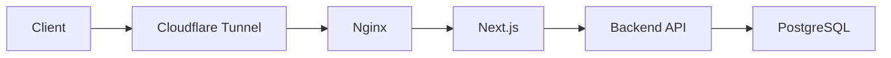

# 目次


  - [前回のまとめ](#前回のまとめ)
  - [前回の補足](#前回の補足)
  - [alt-backendの誕生](#alt-backendの誕生)
    - [初期のアーキテクチャ図](#初期のアーキテクチャ図)
    - [体感やパフォーマンス](#体感やパフォーマンス)
    - [よかったところ](#よかったところ)
      - [以下パフォーマンス計測結果](#以下パフォーマンス計測結果)
    - [設計ミス](#設計ミス)
      - [カーソルベースにしなかった](#カーソルベースにしなかった)
      - [🙅🏽‍♂️マイクロサービスでのアンチパターンをぬるっと採用した](#🙅🏽‍♂️マイクロサービスでのアンチパターンをぬるっと採用した)
    - [用語](#用語)

# Part 2: バックエンドAPIの進化について書いていく

前回は[こちら](https://zenn.dev/e_kaikei/articles/4e5dff3513123b)

[実際のコードはこちら。](https://github.com/Kaikei-e/Alt)

**文章は全文手打ち？ですが、内容のパフォーマンス計測などにはAIを利用しています。**

マイクロサービスが多数あってそれぞれに名称があるので、最後に概要を記載しているが、基本的には今後の記事で出てくるので無視してもらってかまわない。

## 前回のまとめ
前回の記事では、Altの概要とアーキテクチャ、技術スタックについて紹介した。
今回は、核となるバックエンドAPIとその周辺マイクロサービスの導入までの進化と変遷について見ていく。
意思決定と反省、そして軽く現状までを、ADR（Architecture Decision Records）を振り返りながら記述していく。

## 前回の補足
まず、Cloudflare Tunnelを使うことで、自宅のPCを稼働させつつ出先からのアクセスを可能にしている。
そして、コード品質や開発の進め方を、なるべくプロダクションコードレベルへと近づけることを目指した。
どうせ作るなら、ユーザー体験が良く（使い勝手、システムの安定性など）、パフォーマンスの優れたものを作りたかった。
自分が本気で、今の実力を出し切ったものを作りたかった。

## alt-backendの誕生
初期は単純なREST APIとして設計し、実装した。
今のAltのようにファットなマイクロサービス群ではなく、GPUを要求せず、マイクロサービスの数も少なかった。
というよりも、本当にいくつかの骨組みとなるサービスがあるだけだった。
<br>

下記が概要になる。

- Docker Composeを採用した。簡単で素早く形にするには、Kubernetes（k8s）は過剰だと判断したからだ。
  - とにかくどの環境でも迅速に立ち上げられることを、当初は目標としていた。
  - Docker Composeでサクッと環境を立ち上げる手段に慣れ親しんでいたし、k8sの利用は考慮事項が増えて、ただのRSSリーダーをホストするには過剰だと判断した。
  - CI/CDの文脈やプロダクション品質を目指すなら、BGスイッチなどで環境を切り分けていく必要があると思う。だが、セルフホストで、なるべくシンプルで、素早く環境構築が可能なことを優先して、今もk8sは採用しない方針を取っている。
- Clean Architectureを採用した。
  - 仕事でも採用しているアーキテクチャであり、基本的にすべてのマイクロサービスに適用することで、一人での管理やLLMに開発を任せる際に有利だと考えたからだ。
  - また、個人的にはDriver層の差し替えで、他の自前APIなのか、外部サービスなのか、DBなのかなどを簡単に切り替えられることは、ソフトウェアエンジニアとしてとても感動する瞬間で、綺麗に作れた際に満足感が高いからだ。
- データ永続化にはPostgreSQLを採用した。
  - これは完全になじみがあるので、選んだ。
- フロントエンドにはNext.jsを用いて、Cloudflare Tunnelからの通信はNginxで受けてルーティングする設計だった。
  - ReactやNext.jsを仕事・プライベート問わず使ったことがあるが、この際に本腰を入れて学んでみようという意図があったように思う。
- サムネイル画像は表示しないことにした。表示が重くなるし、帯域を食うし、モバイルUIの画面占有率が高すぎると考えたため。
- とにかく簡素だけれど、出先で簡単にRSSフィードのリストを快適に見られることにこだわった。

<br>

### 初期のアーキテクチャ図



<br>

きわめて単純な、フィードの閲覧が主な機能で、そこに加えて購読フィードのCRUDができるシステムとして作成した。

<br>

ぱっと思い出せる範囲での初期機能

- スマホなどのモバイル端末優先のUI
- フィードの閲覧
- 購読フィードのCRUD
  - RSSフィードのURLを登録する機能
- 無限スクロール
  - React/Next.jsのライブラリを使って簡単に実装できてしまった記憶がある。
- フィードのお気に入り機能


### 体感やパフォーマンス

- 機能も少ないのでサクサクで、Lighthouseのスコアもこまめに気にしなくていいレベルだった。
  - 下記スクショの通りに「Performance」が77で、低い気もするが…
  - 画面がちらつくことはあったが、そこまで問題にならなかった記憶がある。というのも、この後に開発を続けていった結果、体験が悪くなりフロントエンドのフルリプレースを行ったからだ。
- UIコンポーネントも少なく、バンドルサイズも気にならないレベルだった。
- 画像を捨てて、文字列だけにしたことで転送量も減り速かった。


これが開発初期の実際のLighthouseのスクリーンショット。


そして、今記事を書いているときに、ネットワークを「Fast 4G」にスロットリングさせて計測したものがこちら。Best Practicesが77点になっているのは、Cloudflare Tunnelの影響だ。なにかCloudflare側の設定をミスっているかもしれないが、今回は趣旨から外れるので無視する。


### よかったところ

- 前述の通りに再三書いてしまったが速い。…はず。というのも、セルフホストで自分しか使っていないため。
  - K6でパフォーマンス計測してみたが、必要十分だと思う。
- クリーンアーキテクチャとGo・Echoを採用し、自分が書いたコードを元にLLMが拡張してくれたが、そこそこの品質かつスピードを維持したまま機能追加できた。
- DBへのクエリの際には、カーソルベースでのクエリにした。Offsetベースだとデータ量が増えると遅くなる問題に直面したため。
  - また、EXPLAIN句を使ってクエリ自体のパフォーマンスも計測しつつ、遅い箇所は最適化を行っている。
- そして、直近ではConnect-RPCへと移行し、データ通信容量の削減と低レイテンシを実現した。
  - JSONのシリアライズとデシリアライズが遅かった。
  - Connect-RPCだから速いとかではなく実装次第なのだが、現状の実装においては明らかにエンドツーエンドで速くなった。（上に記載のFast 4GのLighthouseスコア参照）
  - おそらくデータ転送量（ペイロードサイズ）の減少が寄与している。

#### 以下パフォーマンス計測結果

これらは今さっき計測した値で、最新のバックエンドAPIのパフォーマンスになっている。[K6](https://k6.io/open-source/)を使って、簡易的に計測した。
まあ、localhostで実験しているので、それは速いでしょうという気もしなくもないが、良しとする。

##### スモークテストの結果
まず、閾値をクリアしているか？のテスト


重すぎてレスポンスが遅くてエラーになるとか、95パーセンタイルを下回るとかなく、結果は良好であると思う。

<br>

次に、レスポンスタイムの結果。


まあ、これもユーザー数が少ないので、数値に意味があるのか怪しいが、あくまで個人利用でのバックエンドにボトルネックはないと言えると思う。

<br>

次に、エンドポイントごとのレスポンス結果。


同じく問題はないパフォーマンスだと思う。

<br>

そして、スモークテストのまとめ。


Connect-RPCを現在は利用しており、それも効いている。Connect-RPC採用以前と以後では、Lighthouseのスコアも向上したため。


##### ロードテスト

そして、ロードテストの結果。
15.0msの平均レスポンスタイムなので良好だと思う。
95パーセンタイルでも、50msを超えていない。
実装したレートリミットが発動していることも補足しておく。


じゃあ、良いことづくめに、最初から高速で、安定していて、設計的にも問題なかったかというと、そんなことはない。

### 設計ミス

#### カーソルベースにしなかった

オフセットベースでSQLクエリを書いて、レスポンスが1秒→3秒→7秒みたいにだんだんと遅くなっていった。
データの増加を見込んで設計・実装していなかったためだ。
実際には、2、3秒くらいで遅すぎて耐えられなくなり、カーソルベースへのクエリへと修正したが、OFFSETで100件とか簡単に取れるじゃん！というのは誤りだった。
下記のようにした場合には、ORDER BYしたのちに1000レコード目から100件取得したいわけだが、1100件分読み込んでから100件を返すので、1000件無駄にしている。
これが1000件ならまだよいかもしれないが、では100万件なら？すごい無駄なことをしていて、線形にコストが増加する。
この基礎的なことをやってしまっていた。


```sql
SELECT * FROM articles ORDER BY created_at DESC LIMIT 100 OFFSET 1000;
```

改善例はこちら。実際のクエリ。
Claude的にはまだまだ改善の余地ありらしいので、~~ 今後直す ~~。
直した（2026年2月27日）。よくなっているはず。

```sql
SELECT
	a.id,
	a.feed_id,
	a.title,
	a.content,
	a.url,
	a.created_at,
	COALESCE(ARRAY_AGG(ft.tag_name) FILTER (WHERE ft.tag_name IS NOT NULL), '{}') as tags
FROM articles a
LEFT JOIN article_tags at ON a.id = at.article_id
LEFT JOIN feed_tags ft ON at.feed_tag_id = ft.id
WHERE a.id = ANY($1) AND a.deleted_at IS NULL
GROUP BY a.id

```

#### 🙅🏽‍♂️マイクロサービスでのアンチパターンをぬるっと採用した
いわゆる、Shared Database アンチパターンを採用していた。
初期はalt-backend(Backend API)がalt-db(メインのPostgreSQL)にアクセスするのみであったが、マイクロサービスを追加する際に前述のShared Database アンチパターンを採用してしまった。
ユーザーのアクションによる記事取得を担うマイクロサービス（pre-processor: その名の通りに前処理を担う。HTMLを取得して、解析の後に画像の破棄や本文の抽出を行う）や、フィード検索に使うためのMeilisearchのインデクシングを行うマイクロサービス（search-indexer）など、多数がメインのDBに依存する形になってしまった。
今となっては、なぜそうしたのかわからないし、おそらく簡単に実装できてしまうからといったくらいの理由で判断したのだと思う。深く考えずにいたと思う。そして、これがアンチパターンだと痛感していなかったし、原因がこの設計にあると認識できていなかった。

<br>

3パターン、10件あまりのバグや問題を引き起こしていた。
長くなりすぎるので、ざっとまとめる。

- 構造的な問題
- データ整合性の問題
- Shared Databaseからの移行時に発生した問題


##### 構造的な問題

まずは、単純なところから。

> コネクションプールが枯渇した。

これは複数サービスから接続することで、コネクションプール数が暗黙的になり起きた問題だ。

> 外部キー制約が無く、`feeds` テーブルに `feed_link_id` FK が存在せず、全ユーザーが全フィードを閲覧可能に。

笑えない。プロダクションだったら大事故だ。
これは、当初はユーザーという概念が無い状態から力技で移行したことも原因だろう。

##### データ整合性の問題

> 重複データが生まれた

マイグレーションの適用状態とスキーマの実態が乖離しても、他サービスが動作していたため発覚が遅延して、UI操作が壊れて発覚した。データオーナーの明確さが重要だと体感した。

##### Shared Databaseからの移行時に発生した問題

> Backend APIへとデータオーナーの責務を寄せて修正した際に、複数のサービスが動作しなくなった。

クエリでバッチ処理していたが、Backend APIのRPC（Remote Procedure Call）に変更した際に、pre-processorが担っていた責務を移行しきれず、要約処理が壊滅した。

<br>

学び💁🏾
> Shared Databaseはやめよう。問題が潜んで、膨らんで、後で爆弾になります。最初期からもバグとして爆発します。


### 用語

- alt-backend: 中心となるバックエンドAPI
- alt-db: メインのPostgreSQL
- pre-processor: その名の通りに前処理を担う。HTMLを取得して、解析の後に画像の破棄や本文の抽出を行う。LLMへの要約依頼や要約の品質チェックリクエストも担っている。イメージとしては、バックグラウンドでのフィード関連の処理を一手に引き受けるアプリケーションだ。
- search-indexer: Rust製のオープンソース検索エンジンであるMeilisearchの操作を行うマイクロサービス。バッチ処理で記事をインデクシングする。これによって、フィードや本文横断で検索が可能になる。また、Meilisearchの機能であるタイポ（打ち間違い）許容をそのまま活用しているので、検索時にも打ち間違いへの耐性を持っている。

